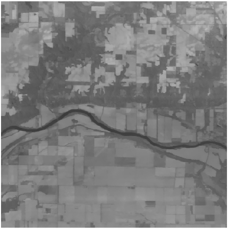
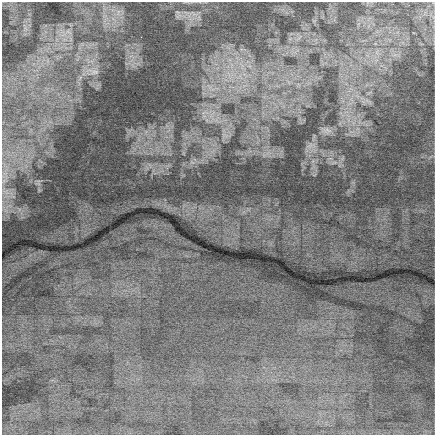
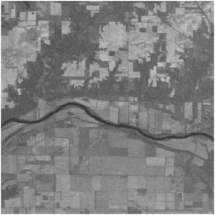
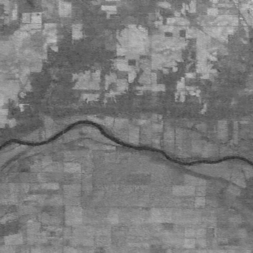
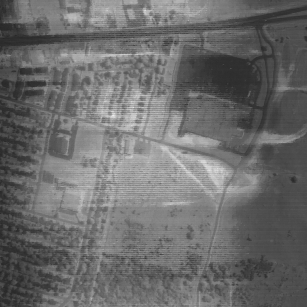
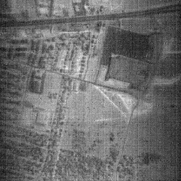
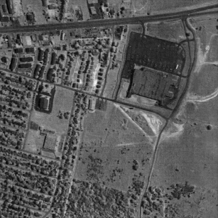
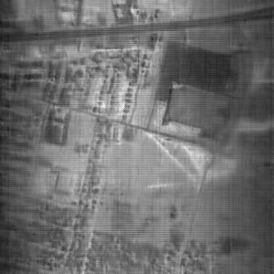

1. Directory structure
```
\saved_models
    \cave
        \beta_2d_pt       pretrained model
        \gamma_ftall      finetuned model

pretrain_cscnet.py        pretraining the 2D CSC-Net on dataset with Clean-Noisy Paired
RCSCNet.py                Model
train_rcscnet.py          Finetuning the 3D RCSC-Net on target Noisy HSI

```


2. Results on Real World Dataset
Results on two Real World Dataset
2.1. Indian 
Input image at 149th band
{:height="256px" width="256px"}
Reconstructed image at 104th band by BM3D
{:height="256px" width="256px"}
Reconstructed image at 104th band by BM4D
{:height="256px" width="256px"}
Reconstructed image at 104th band by LRTV
{:height="256px" width="256px"}
Reconstructed image at 104th band by SIP
{:height="256px" width="256px"}
Reconstructed image at 104th band by HSI-TS
{:height="256px" width="256px"}
Reconstructed image at 104th band by N2N
{:height="256px" width="256px"}
Reconstructed image at 104th band by Ours
{:height="256px" width="256px"}
2.2. Urban 
Input image at 104th band
{:height="256px" width="256px"}
Reconstructed image at 104th band by BM3D
{:height="256px" width="256px"}
Reconstructed image at 104th band by BM4D
{:height="256px" width="256px"}
Reconstructed image at 104th band by LRTV
{:height="256px" width="256px"}
Reconstructed image at 104th band by SIP
{:height="256px" width="256px"}
Reconstructed image at 104th band by HSI-TS
{:height="256px" width="256px"}
Reconstructed image at 104th band by N2N
{:height="256px" width="256px"}
Reconstructed image at 104th band by Ours
{:height="256px" width="256px"}

1. Convergence Analysis
The changes in PSNR and loss across training epochs are visualized in the plot for CAVE case 3.

Generally, our model converged with epochs of 200.
