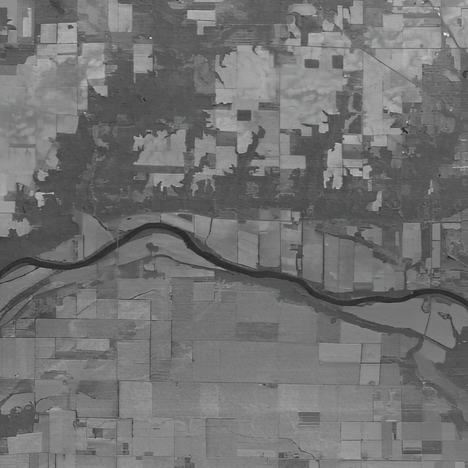
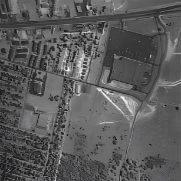
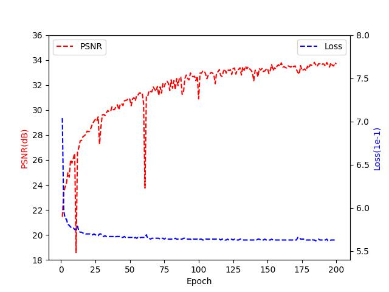

1. Directory structure
```
\saved_models
    \cave
        \beta_2d_pt       pretrained model
        \gamma_ftall      finetuned model

pretrain_cscnet.py        pretraining the 2D CSC-Net on dataset with Clean-Noisy Paired
RCSCNet.py                Model
train_rcscnet.py          Finetuning the 3D RCSC-Net on target Noisy HSI

```


2. Results on Real World Dataset
Results on two Real World Dataset

2.1. Indian 
Input image at 149th band


Reconstructed image at 104th band by Ours



2.2. Urban 

Input image at 104th band


Reconstructed image at 104th band by Ours



1. Convergence Analysis
The changes in PSNR and loss across training epochs are visualized in the plot for CAVE case 3.



Generally, our model converged with epochs of 200.
